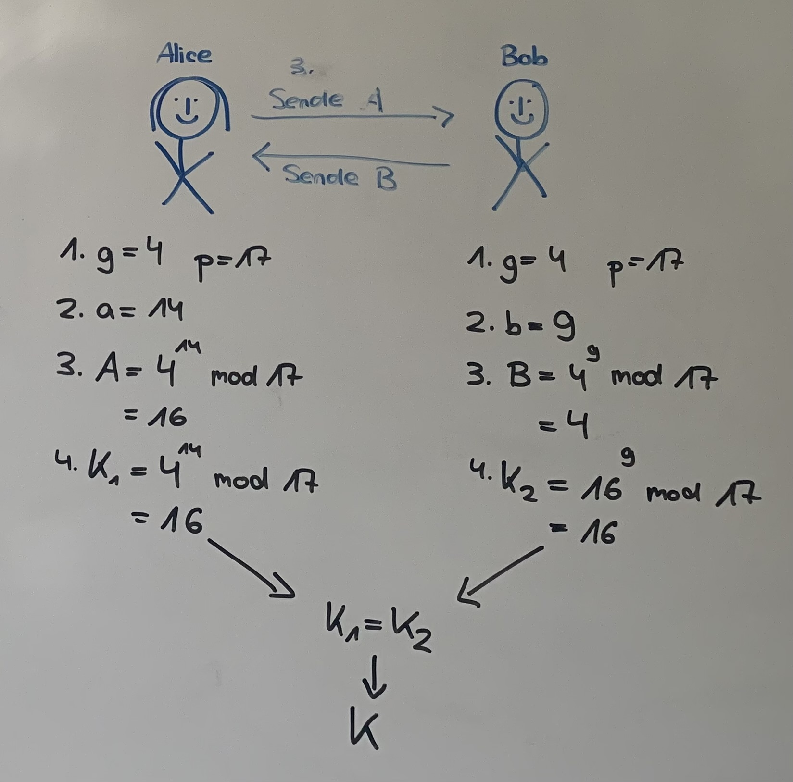

# Diffie-Hellman
- Protokoll zur Schlüsselvereinbarung
- zwei Kommunikationspartner (siehe Beispiel: Alice und Bob) können über eine öffentliche, abhörbare Leitung einen geheimen Schlüssel austauschen in Form einer Zahl
- der vereinbarte Schlüssel kann anschließend für zum Beispiel die symmetrische Verschlüsselung verwendet werden (DES oder AES)

## Key-Facts über das Protokoll
- wurde 1976 als erstes asymmetrisches Kryptoverfahren veröffentlicht
- (das GCHQ entwickelte bereits in den 1970er-Jahren ein asymmetrisches Verfahren durften es aber nicht veröffentlichen :)

- Der DHM-Schlüsselaustausch zählt zu den Krypto-Systemen auf Basis des diskreten Logarithmus (DL-Verfahren) aber was heißt das ? (mehr dazu später)
- der DHM-Schlüsselaustausch ist allerdings nicht sicher, wenn sich ein Angreifer zwischen die beiden Kommunikationspartner schaltet und Nachrichten verändern kann (Abhilfe schafen die beiden Protokolle Station-to-Station-Protokoll (STS) durch zusätzliche digitale Signaturen und Message Authentication Codes)

